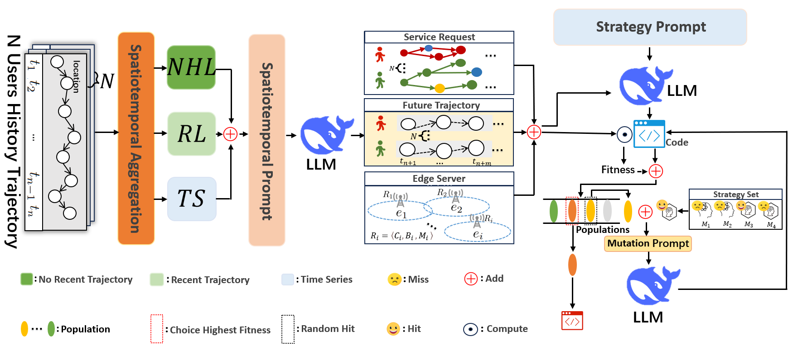

# SAMPLE
## Framework


## Requirements

    pip install -r requirements.txt

## Usage
We take the Geolife dataset for example.
- Preprocess using the MHSA paper method:


     We preprocess the original dataset using the method described in the MHSA paper. 
     For more details, you can refer to the following repository.

- trajectory prediction:  

  ```bash
  python Spatial-temporal Perception Module.py
- Allocate service chains for each user:

  ```bash
  python Service chains allocation.py
- Simulate edge servers based on the predicted location information:

  ```bash
  python Simulated BaseStation.py
- Integrate user requests data, edge servers data, and microservice resource consumption data to generate pre-deployment data:

   ```bash
  python Geolife Data merging.py
- Generate pre-deployment strategies:

   ```bash
   python main.py

## ACKNOWNLEDGES
The implementations of MHSA is based on the following GitHub Repository. Thank for the work.
<span id="citation-4"></span>

- MHSA: https://github.com/mie-lab/location-prediction
